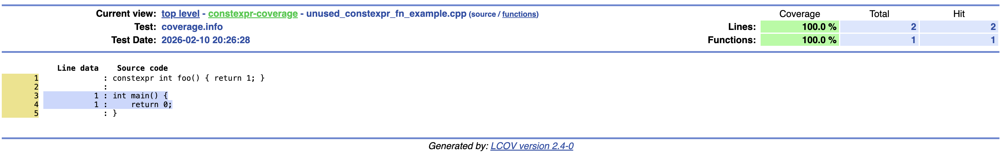
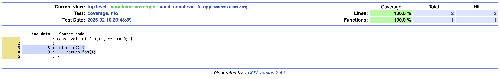
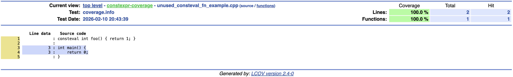

I was curious how the `gcov` line coverage analysis tool would handle code which is evaluated at compile time. I threw together a few simple examples utilizing `consteval` and `constexpr` statements in various contexts. In this article I go over those examples and images of the corresponding `lcov` report for easy viewing.

The main takeaway is not surprising given `gcov` works by instrumenting compiled binaries - the coverage reports omit any lines of code which do not manifest in the compiled binary. There are some potentially interesting behaviors though, especially around use of `constexpr` functions at runtime.

# Examples
For each example, I provide a screenshot of the coverage report and some commentary.
The important takeaway is that code which does not make it into the final binary never counts toward the line count - even if the source-level semantics would allow a runtime call in a different instantiation or configuration.

## `if constexpr` flow control

`if constexpr` flow control statements and the corresponding eliminated branches are omitted from the coverage analysis.

## `constexpr` functions
### Unused `constexpr` function

A `constexpr` function which isn't used is totally omitted from the line count. 

### `constexpr` function used at compile time

A `constexpr` function used in a compile-time context is also omitted from the line count altogether.

### `constexpr` function used at runtime

A `constexpr` function used at runtime is included in the line count.

There's an interesting implication to this behavior. If a `constexpr` function contains many lines of code, or calls many other `constexpr` functions, then the addition of a runtime invocation of the function could bring in a huge number of additional lines of code into the analysis. Unlike non-`constexpr` logic, this previously-uncovered lines would not display in the coverage results until their runtime use was added. The addition of a single line of code - a runtime call of a `constexpr` function - could potentially trigger huge swings in the total line count and coverage results!

## `consteval` functions
### Used `consteval` function

Even if a `consteval` function is used in a runtime function, it does not appear in the report.

### Unused `consteval` function

Similar to `constexpr` functions, unused `consteval` functions do not show up in the report. 

# Conclusion
I was happy to find that, in general, it's handled gracefully. Statements evaluated at compile time do not show up in coverage reports. There was some potentially interesting behavior to note though - `constexpr` statements never show up as missed coverage even when unused, but they do show up as additional covered lines when the `constexpr` statement execututes at runtime.

The most interesting result by far is the implication that a `constexpr` function's use in a runtime context can potentially have a cascading impact on other `constexpr` code's inclusion in the analysis and bring in arbitrarily large amounts of additional logic in a coverage report.

I'm interested in how the `template for` construct in C++26 will be handled. Those constructs are expected to generate runtime executable code which manifests in the binaries. I don't have a compiler that supports it yet easily installable on my Mac, but as soon as I do I'll test it out and give an update! 

You can check out and run the examples explored here on your own computer on [Github](https://github.com/sam-w-yellin/constexpr-coverage). Just clone the repo, run `make html-coverage`, and open up `html-coverage/index.html`.

If you found this article valuable, consider subscribing to the [newsletter](https://volatileint.dev/newsletter) to hear about new posts!