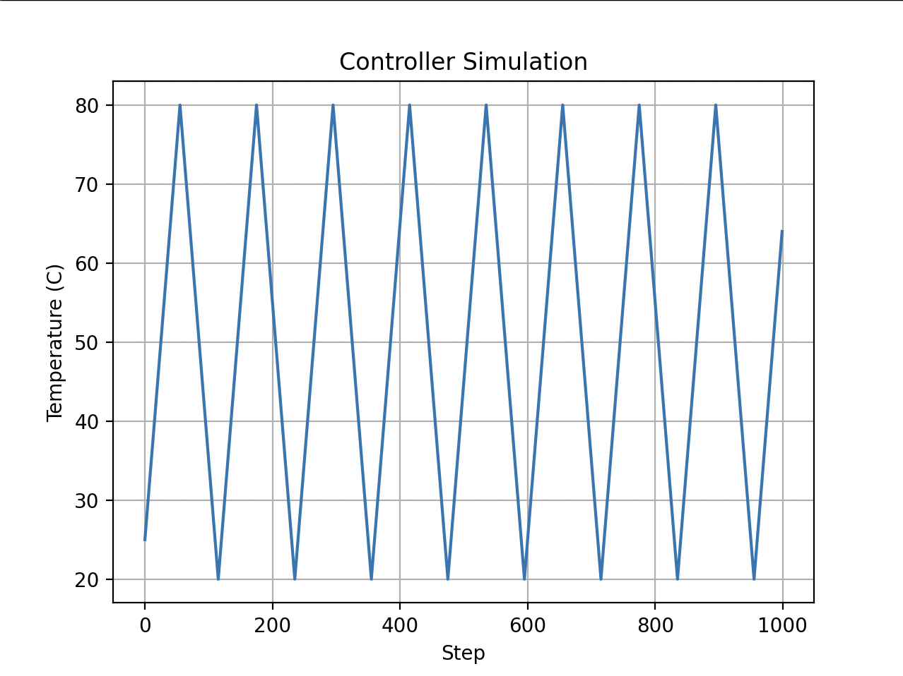

In this post, we're going to implement a generic interface for creating a wide variety of closed-loop control systems. We'll end with a flexible template library capable of implementing whatever control algorithm you'd want, enforced separation of concerns, flexible configuration, consistent error handling, and support for logging. We will use modern C++ infrastructure such as template `concept`s,  `std::expected`, and lambda functions.

Before we dive in, I want to acknowledge that the final code utilizes a good number of advanced C++ facilities for what may appear to be a relatively simple set of functionality. In the course of reading, you may balk at the complexity introduced for the sake of consistent abstraction. Hopefully the culmination of what we have built presented in the last section of the post sufficiently motivates the complexity tradeoff for projects with many controllers or which need to distribute the development responsibilities of the control laws and hardware interfaces across teams.

First, let's kick things off with a scenario.

## A Simple Bang-Bang Controller
Picture yourself as an embedded software engineer working at a scrappy startup designing a revolutionary new technology with a healthy mix of hardware and software co-development. Your co-worker - a thermal engineer responsible for maintaining the health of a temperature-sensitive component of the system - approaches you, asking for software to regulate the temperature of their system:

- A thermoelectric cooler (henceforth referred to as a TEC) connected to the component that needs to be cooled. The engineer connected this to a simple switch which will apply either 0 or 100% power.
- A thermocouple connected to the device being cooled to sense the temperature.
- A microcontroller wired to control the TEC using the thermocouple as feedback.

The system generates heat during operation, so the only active element necessary is a cooler. Analysis shows that component needs to be kept between 20 and 80 degrees Celsius. Every minute the temperature should be checked. If the reported temperature is 80 degrees of above then the TEC should be turned on until the temperature hits the lower bound of 20 degrees.

You write a very minimal program:
```c++
#include <thread>
#include <chrono>
#include "gpio.hpp"
#include "adc.hpp"

void control_tec() {
    Gpio tec{ 1 }; // TEC is on pin 1
    Adc thermocouple{ 2 }; // thermocouple on pin 2

    tec.Configure(Gpio::Output);
    thermocouple.Configure();

    while (true) {
        const auto raw_temp_adc = thermocouple.read();
        const auto temp_uc = static_cast<float>(raw) * 0.1f;

        if (temp_uc >= 80) {
            tec.Set(true);
        } else if (temp_uc <= 20) {
            tec.Set(false);
        }
        std::this_thread::sleep_for(std::chrono::minutes(1));
    }

}

int main() {
    control_tec();
}
```

This implementation is functional, but fails to address important long-term considerations for production systems. 

What happens when the control law needs to change? What about when the GPIO is changed for a PWM output, or when the on-chip ADC is replaced with a more accurate off-chip device?

How do we make sure this code actually serves all our purposes? It doesn't appear to handle errors. It doesn't provide insight into the status of the controller. It doesn't have any sense of configuration - the bounds are hard-coded. We have no facilities to log state, or understand if our feedback or actuation mechanisms have failed to accomplish their tasks.

What about consistency across the codebase? If we are working in a system with lot of controllers - as many embedded systems and embedded software platforms must support - how do we make sure they're all implemented in a consistent way? Consistency is critically important for maintaining developer velocity in complex code bases, and so it is a matter of utmost importance that we do not arbitrarily do the same thing in wildly different ways. As written a second control algorithm would violate the DRY principle - the knowledge of *how control laws are structured* should be centralized.

And finally - what about testability? The folks who write these control laws are often not the embedded software teams. The control law is inextricably tied to the hardware used for gathering feedback and effecting output. Is the control team expected to maintain simulations for hardware in order to iterate on control laws? Are they bound in experimenting with new control algorithms by the existance of hardware drivers and hardware simulation infrastructure?

These problems can be addressed - and enforced across all controllers implemented in the codebase - by providing *scaffolding* for the domain of control law implementations. 

## Defining a Framework for Closed-Loop Control Algorithms

Requirements for the scaffolding can be derived from the above use cases:

1. Control laws shall be independently testable from any specific hardware configuration.
2. Controller feedback and actuation mechanisms shall explicitly handle all IO and configuration errors.
3. Controllers shall emit representations of their current state suitable for logging.
4. The data flow between the feedback, control law, and actuation mechanism shall be explicitly defined in order to enforce consistency.

We also have these design goals: 
1. It should be *easy* to write control laws that abide by the requirements.
2. To the extent possible the constraints imposed by the requirements should be checked at compile-time.

### Components of a Controller
The controller consists of three logically distinct components: 
1. A purely mathematical control law that receives inputs and computes outputs in order to achieve some goal.
2. A feedback mechanism which interacts with some external interface to collect measurements.
3. An output mechanism which effects the values commanded by the control law into the world.

In a given step of the controller data flows first into the feedback component. Then, the data is converted to a format useable by the control law which uses the feedback to calculate the next output value. The output value from the controller is converted to the required data type to emit to a physical component. 


flowchart LR
  S[Feedback Sensor]
  FB[Feedback Component<br/>e.g., ADC]
  LAW[Control Law<br/>e.g., Bang-Bang]
  ACT[Actuator Component<br/>e.g., GPIO]
  AHW[Actuator Hardware]

  S -->|Raw measurement| FB
  FB -->|Converted measurement| LAW
  LAW -->|Command / control output| ACT
  ACT -->|Actuation signal| AHW


Let's ground this in our TEC example. The ADC is the feedback. ADCs read a voltage. The control law for a TEC is going to deal with temperatures in degrees C, so the voltage must be converted to degrees. The control law emits a boolean - the TEC is on or off. For the bang-bang controller discussed earlier, the output GPIO uses the same data type as the controller output.

The data types for input and output from the control law *constrain* the feedback and actuator components. The control law cannot provide its own adapters without violating the independent testability requirement. Feedback and actuator interfaces must define those conversions themselves. Template `concept`s introduced in C++20 are naturally able to express the relationship between the interface data types.
 
#### ControlLaw Interface
Let's start out writing a concept for our most abstract component - the `ControlLaw`. The concept requires that each law defines its input and output types - `Measurement` and `Command` respectively. Laws must also define a `State` type.

There are two required APIs for a `ControlLaw`:

1. `Initialize` configures the internal `ControlLaw` state. It must return the initialized `State`, or a `std::string_view` in the case of an error. This is where the config for the law can be validated and return an error if necessary.
2. `Compute` takes in a measurement, and returns a tuple of the next `Command` and its current `State`. 

These interfaces enforce two of our requirements - that the controller implements error handling, and that we have visibility into the current state of the controller. 

```c++
template <typename C>
concept ControlLaw = requires(C law, const typename C::Measurement& m) {
    typename C::Measurement;
    typename C::Command;
    typename C::State;

    { law.Initialize() } -> std::same_as<std::expected<typename C::State, std::string_view>>;

    {
        law.Compute(m)
    }
    -> std::same_as<std::expected<std::pair<typename C::Command, typename C::State>, std::string_view>>;
};
```

Notice that the controller is completely independent of the actuator and feedback mechanisms. This decoupling enables our testability requirement - a class abiding by the `ControlLaw` concept can be instantiated independent of the larger controller infrastructure.

#### External Interfaces
Now let's implement our Feedback and Actuator concepts. As discussed earlier, these interfaces are dependent on the `ControlLaw`'s defined data types. This is represented in our concepts as a template parameter for the `ControlLaw`, from which we extract the `Measurement` and `Command` data types:

```c++
template <typename FB, typename Law>
concept Feedback = ControlLaw<Law> && requires(FB fb) {
    typename FB::State;

    { fb.Configure() } -> std::same_as<std::expected<void, std::string_view>>;

    {
        fb.Read()
    } -> std::same_as<
        std::expected<std::pair<typename Law::Measurement, typename FB::State>, std::string_view>>;

    { fb.Convert(std::declval<typename FB::Raw>()) } -> std::same_as<typename Law::Measurement>;
};

template <typename AC, typename Law>
concept Actuator = ControlLaw<Law> && requires(AC ac, const typename Law::Command& cmd) {
    typename AC::State;

    { ac.Configure() } -> std::same_as<std::expected<void, std::string_view>>;

    { ac.Write(cmd) } -> std::same_as<std::expected<typename AC::State, std::string_view>>;

    { ac.Convert(std::declval<typename Law::Command>()) } -> std::same_as<typename AC::State>;
};
```

These concepts closely mirror each other. They are designed to encapsulate external-facing dependencies and abstract away conversion to the `ControlLaw`types. The interface entails:
1. A `Configure` function that ensures the output interfaces are ready for control and returns a `std::string_view` on error. 
2. A function to interface with the external world - `Read` and `Write` for the `Feedback` and `Actuator` interfaces respectively. 
3. A `Convert` function that goes from the respective internal type to the data type expected by the template `ControlLaw`.

Just as in the `ControlLaw` concept, `std::expected` is used to enforce error handling and state reporting.

#### Integrated Controller
Finally, we implement an integrated `Controller` class. This class is templated on a specific set of `Actuator`, `Feedback`, and `ControlLaw` concept implementations. It orchestrates the dataflow between components and exposes the external interface to the represented controller.

```c++
template <ControlLaw Law, Feedback<Law> FB, Actuator<Law> ACT>
class Controller
{
   public:
    using Measurement = typename Law::Measurement;
    using Command = typename Law::Command;

    Controller(FB& feedback, ACT& actuator, Law& law) : fb_(feedback), act_(actuator), law_(law) {}

    std::expected<typename Law::State, std::string_view> Initialize()
    {
        auto err = fb_.Configure();
        if (!err) {
            return std::unexpected(err.error());
        }
    
        err = act_.Configure();
        if (!err) {
            return std::unexpected(err.error());
        }

        auto law_state = law_.Initialize();
        if (!law_state) {
            return std::unexpected(law_state.error());
        }
        return law_state.value();
    }

    std::expected<ControllerState<FB, Law, ACT>, std::string_view> Step()
    {
        auto fb_result = fb_.Read();
        if (!fb_result) {
            return std::unexpected(fb_result.error());
        }
        auto [measurement, fb_state] = *fb_result;

        auto law_result = law_.Compute(measurement);
        if (!law_result) {
            return std::unexpected(law_result.error());
        }
        auto [command, law_state] = *law_result;

        auto act_result = act_.Write(command);
        if (!act_result) {
            return std::unexpected(act_result.error());
        }
        auto act_state = *act_result;

        ControllerState<FB, Law, ACT> state{
            .feedback_state = fb_state, .control_state = law_state, .actuator_state = act_state};
        return state;
    }

   private:
    FB& fb_;
    ACT& act_;
    Law& law_;
};
```

## Revisiting the Bang-Bang Controller
All the pieces are now in place to implement controllers using our generic template scaffolding. The following example implements the simple bang-bang controller for a TEC discussed earlier.

First - we need to create concrete implementations of our ADC feedback, GPIO actuation, and bang-bang control law concepts. We use an `auto` template parameter for the conversion functions so that the entire set of functionality is determined at compile time. This approach is nice for embedded contexts where we really want to push as much work to compile-time as possible but does impose some limits on what your conversion function can do. If you need a capture in your conversion function for any reason, you could always pass the lambda into the constructor, or just hard-code it into your implementation if it won't change.

**File**: `example/components/feedback_controller/plugins/feedback/include/adc_feedback.hpp`




**File**: `example/components/feedback_controller/plugins/actuators/include/gpio_actuator.hpp`




**File**: `example/components/feedback_controller/plugins/laws/include/bangbang_range.hpp`




It is worth noting the framework is flexible for whatever configuration any given aspect of the controller requires. In this case, we provide min and max thresholds for the bang-bang controller. Let's also create another version of our bangbang control law which controls to a specific setpoint instead of a range. We'll use this later to demonstrate swapping parts of the controller.

**File**: `example/components/feedback_controller/plugins/laws/include/bangbang_setpoint.hpp`





With these components - and the simulated ADC and GPIO interface implementations defined by the [linked GitHub repo](https://github.com/sam-w-yellin/feedback-controller)  - we can actually instantiate and execute a controller. Instantiation is simple:

```c++
// Simulated hardware
SimulatedAdc adc;
SimulatedGpio gpio;

// Bang-bang control law
BangBangRangeLaw law(20 /* min */, 80 /* max */);

// ADC Feedback
auto convert_adc = [](uint16_t raw) -> BangBangLaw::Measurement
{ return static_cast<BangBangRangeLaw::Measurement>(raw) / 10; };
AdcFeedback<BangBangRangeLaw, decltype(convert_adc)> feedback(adc, convert_adc);

// GPIO Actuator
auto convert_gpio = [](bool cmd) -> BangBangLaw::Command { return cmd; };
GpioActuator<BangBangRangeLaw, decltype(convert_gpio)> actuator(gpio, convert_gpio);

// Integrated controller
Controller<BangBangRangeLaw, decltype(feedback), decltype(actuator)> controller(feedback, actuator,
                                                                            law);
```

We can now use the `controller` object to enact our control - first using the `Initialize` API to setup the hardware and control laws, and then the `Step` function to read inputs into and write outputs from the control law.

## Compile-Time Checks
Let's briefly explore what kinds of errors we get if we violate our concepts. One of the constraints is that our `Configure` functions handle errors by returning a `std::expected`. Let's change our AdcFeedback `Configure` function such that it does not handle errors.

```c++
void Configure()
{
    adc_.Configure();
    return;
}
```

Now if we try and build the sim:

```bash
/Users/syellin/blog/examples/feedback-controller/example/bangbang_setpoint_sim/main.cpp:85:5: error: constraints not satisfied for class template 'Controller' [with Law = BangBangSetpointLaw, FB = AdcFeedback<BangBangSetpointLaw, (lambda at /Users/syellin/blog/examples/feedback-controller/example/bangbang_setpoint_sim/main.cpp:76:38){}>, ACT = GpioActuator<BangBangSetpointLaw, (lambda at /Users/syellin/blog/examples/feedback-controller/example/bangbang_setpoint_sim/main.cpp:81:39){}>]
   85 |     Controller<BangBangSetpointLaw, decltype(feedback), decltype(actuator)> controller(
      |     ^~~~~~~~~~~~~~~~~~~~~~~~~~~~~~~~~~~~~~~~~~~~~~~~~~~~~~~~~~~~~~~~~~~~~~~
/Users/syellin/blog/examples/feedback-controller/include/feedback_controller_interface.hpp:55:27: note: because 'Feedback<AdcFeedback<BangBangSetpointLaw, (lambda at /Users/syellin/blog/examples/feedback-controller/example/bangbang_setpoint_sim/main.cpp:76:38){}>, BangBangSetpointLaw>' evaluated to false
   55 | template <ControlLaw Law, Feedback<Law> FB, Actuator<Law> ACT>
      |                           ^
/Users/syellin/blog/examples/feedback-controller/include/feedback_controller_interface.hpp:34:27: note: because type constraint 'std::same_as<void, std::expected<void, std::string_view> >' was not satisfied:
   34 |     { fb.Configure() } -> std::same_as<std::expected<void, std::string_view>>;
```

We are told *exactly* what is wrong - our `Configure` function has the wrong return type. Similar errors will occur if any other aspect of the contract is violated. 

Its also worth taking a look at the lambda functions performing conversions. This is dependent on your particlar `Feedback` and `Actuator` interface implementations, but in our case a mismatch between the lambda return type and the `concept` dictated value will be caught at compile time *as long as you compile with `-WConversion`*. Of course, you **are** compiling with `-Wconversion`, right?

So, we have achieved the design goals: We both have compile-time checks that our interfaces are well formed, and the code is easy to debug when they are not.

## Easily Swappable Components
The following code utilizes the bang-bang controller - instantiated through our scaffolding - to run 1000 steps of the control simulation. This example demonstrates all our requirements - error handling, loggability, strict enforcement at compile-time.

**File**: `example/feedback-controller/example/bangbang_range_sim/main.cpp`




After building and executing this simulation, and running the included `graph_log.py` script - you'll see an output like this:



Let's demonstrate our ability to change controller components independently. If we swap the control law implementations we can create different control behavior without ever touching code related to actuation or feedback. When we run the sim using the setpoint control law, we get the following output:


The entire difference between these two simulations is constrained to details of the control law. This is the only functional difference:
```bash
73c73
<     BangBangRangeLaw law(20 /* min */, 80 /* max */);
---
>     BangBangSetpointLaw law(60 /* setpoint deg c */);
```

##  Size and Performance Analysis
It is important to evaluate our template abstraction's impact on binary size and performance. Let's compare an implementation close to the originally presented controller to our `BangBangRangeLaw` implementation. We'll create a minimal binary that instantiates a controller and runs 100000000 iterations of its `Step` function as the basis for our measurements.

**File**: `example/feedback-controller/example/performance_analysis/simple/main.cpp`




**File**: `example/feedback-controller/example/performance_analysis/template/main.cpp`




Both of these examples were compiled with `gcc` on OSX without debug symbols and with a few different optimization levels. The results are as follows in the tables below.

| Optimization Level | Simple BangBang | Template BangBang |
|:-----------------:|:---------------:|:----------------:|
| `-O0`             | `45K`           | `98K`            |
| `-O1`             | `35K`           | `34K`            |
| `-O2`             | `35K`           | `34K`            |
| `-O3`             | `35K`           | `34K`            |
| `-Os`             | `35K`           | `35K`            |


| Optimization Level | Simple BangBang | Template BangBang |
|:-----------------:|:---------------:|:----------------:|
| `-O0`             | `2.20s`         | `13.19s`         |
| `-O1`             | `0.17s`         | `0.17s`          |
| `-O2`             | `0.17s`         | `0.17s`          |
| `-O3`             | `0.16s`         | `0.16s`          |
| `-Os`             | `0.26s`         | `0.20s`          |

This should be both fascinating and encouraging! It's natural to expect the template implementation is slower and larger than the simple version at `-O0` optimization level. After all, we're actually evaluating success per our interface contracts, and with no optimization templates produce a lot of code. What may be less intuitive is that at all other optimization levels *the template code is both smaller and more performant than the "simple" implementation*.

Clearly, these results demonstrate that our abstractions really are zero-cost at run-time when we allow even simple optimization from the compiler. We have paid no binary size or performance penalty, and in fact have produced more optimized code than the simple example!

## Exercises for the Reader
I encourage you to try extending this functionality yourself! Consider these challenges:

1. Enable runtime configuration of the controller via dependency inversion by creating a base class for each of the concepts.
2. Currently, the `State` objects must be move/copy constructable. Explain why that is the case, and modify the code to permit returning non-copy-able and non-move-able `State` objects
3. Use of `std::string_view` as an error type is fine in most contexts. It avoids any dynamic memory allocation that would come with `std::string`. Even still, highly resource constrained systems may benefit from their own error types with smaller footprints - such as an enumeration. Change the implementation to require a templatized error type. Hint: you may need to look at something like `std::variant` to bubble up the final returned error from the `Controller` class.

These exercises both may be very useful to some applications, and are great ways to apply the patterns learned in this post.

## Conclusion
The design we've implemented demonstrates all the requirements and design goals we set out to achieve. If you are operating in an ecosystem of control laws, this pattern is almost certainly useful. I have implemented similar patterns at multiple organizations and reaped the benefits of consistent control interfaces and implementations at scale. The benefits of cleanly defined component boundaries and separate responsibilities, enforced error checking and state exposure, and swappable feedback/actuator/law implementations come at the cost of complexity. Not only is this implementation more verbose than the simple controller we saw at the beginning - it is undoubtedly more complex. Understanding this implementation fully demands quite a lot from the code maintainers. To reaffirm - this solution makes sense in an *ecosystem* of controllers.

The feedback controller interface is available on [GitHub](https://github.com/sam-w-yellin/feedback-controller) as a single-header to anyone who wants to use it or try out the exercises outlined above. The simulation framework included in the repo also could prove useful to anyone iterating on controllers.

If you found this article valuable, consider subscribing to the [newsletter](https://volatileint.dev/newsletter) to hear about new posts! If you have any feedback or questions, reach out to me at sam@volatileint.dev!